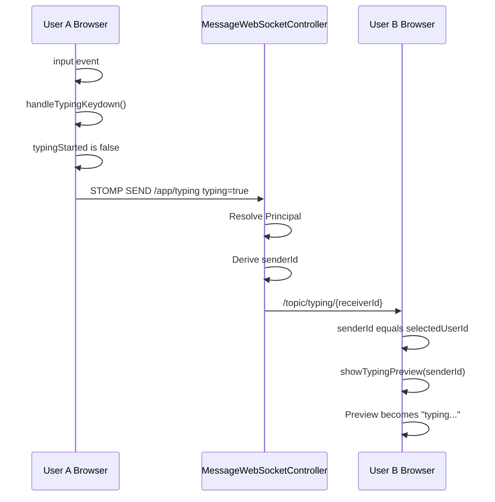
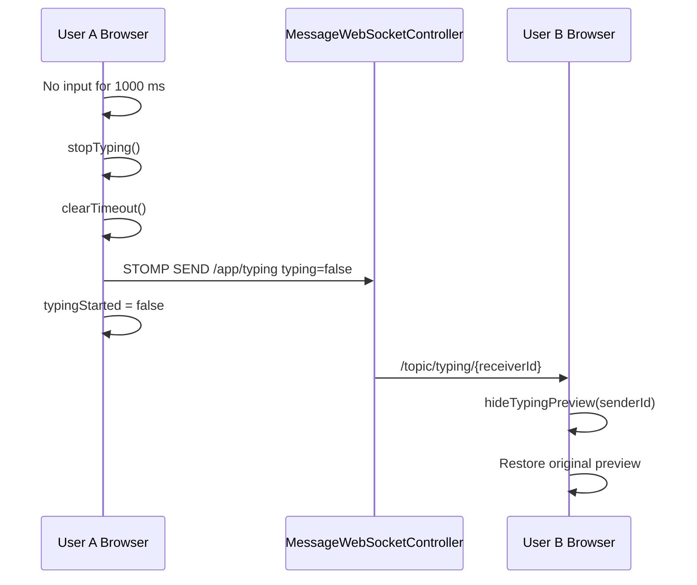
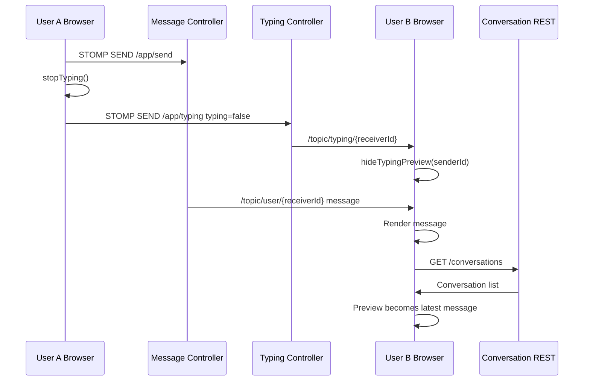
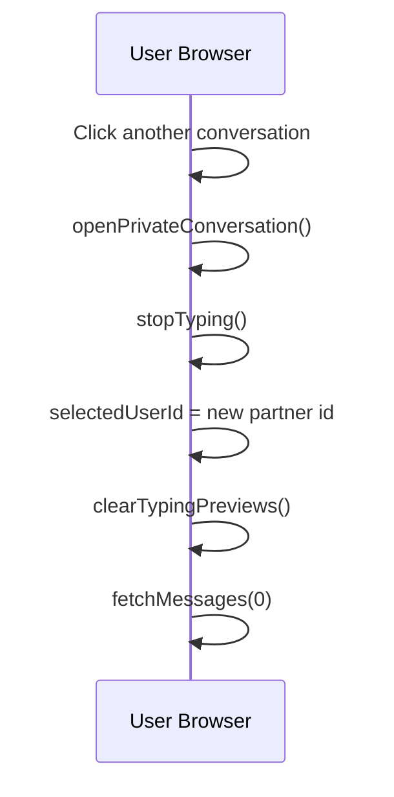

# Typing Indicator Feature

## 1. Overview

The Typing Indicator feature shows a temporary "typing..." status when one user is actively typing in a private conversation.

In this project, the indicator is shown in the conversation sidebar by temporarily replacing the last message preview. It is not shown inside the message history and it is not shown below the chat input.

Normal sidebar state:

```text
----------------------+
| Rohit        online |
| Hello bro           |
+----------------------+
```

Typing state:

```text
+----------------------+
| Rohit        online |
| typing...            |
+----------------------+
```

After typing stops:

```text
+----------------------+
| Rohit        online |
| Hello bro           |
+----------------------+
```

After a real message arrives:

```text
+----------------------+
| Rohit        online |
| Hey, what's up?      |
+----------------------+
```

Complete flow:

```text
User A types in a private chat input
        |
        v
Frontend sends typing=true to /app/typing
        |
        v
Spring WebSocket controller receives TypingDto
        |
        v
Controller derives senderId from authenticated Principal
        |
        v
Controller forwards TypingDto to /topic/typing/{receiverId}
        |
        v
User B frontend receives typing=true
        |
        v
If User B currently has User A's conversation open
        |
        v
Conversation preview changes to "typing..."
        |
        v
User A stops typing for 1000 ms
        |
        v
Frontend sends typing=false
        |
        v
Server forwards typing=false
        |
        v
User B restores the original conversation preview
```

The feature is private-chat only. Public chat does not send typing events and does not display typing state.

## 2. Design Decisions

### Why WebSocket Instead Of REST

Typing is a real-time event. It is useful only if the receiver sees it immediately. REST would require polling or frequent HTTP requests, which would add latency and unnecessary network traffic.

The application already uses STOMP over WebSocket for chat messages, edits, deletes, presence updates, and private message delivery. Reusing that channel keeps the feature consistent with the existing architecture.

Chosen:

```text
client.publish("/app/typing")
```

Rejected:

```text
POST /typing
GET /typing-status
poll every second
```

REST was rejected because typing state is short-lived, not resource-oriented, and not worth storing or polling.

### Why No Database Changes

Typing state is temporary UI state. It does not represent a message, a user preference, or durable business data.

Persisting typing events would create useless records such as:

```text
User 1 typed at 10:10:01
User 1 typed at 10:10:02
User 1 stopped typing at 10:10:03
```

That data is not needed after the moment passes.

### Why No Repository Or Service Changes

The backend does not need to query or mutate persistent state. It only receives an event and forwards it to another topic.

A repository would imply database persistence, which is intentionally avoided.

A service layer was also not added because there is no domain logic complex enough to justify it. The controller performs only:

1. Authentication check.
2. Sender derivation.
3. Null receiver guard.
4. WebSocket forwarding.

Adding a service would make the feature look heavier than it is.

### Why Typing State Is Temporary

Typing is a live signal. Once the user stops typing, sends a message, changes chat, or disconnects, the signal is no longer meaningful.

The state belongs in browser memory only:

```text
typingStarted
typingTimeoutId
conversation preview DOM dataset
```

### Why Debounce Is Required

Without debounce, every key press could send two events or many repeated events:

```text
h -> typing=true
e -> typing=true
l -> typing=true
l -> typing=true
o -> typing=true
```

That would spam the WebSocket broker and receiver UI.

The implemented behavior sends:

```text
first input -> typing=true
continued input -> reset timer only
1000 ms idle -> typing=false
```

### Why The Indicator Should Never Be Persisted

Typing status should not appear in message history, conversation history, or after page refresh. A typing event from five seconds ago is already stale.

If typing indicators were persisted, users could see outdated status like "typing..." even though the sender is offline.

### Why Typing Indicator Is Frontend-Only State

The server only routes the signal. The frontend decides how to display it.

This allows the UI to change without backend changes. The feature originally showed text below the message area. It was later changed to replace the sidebar preview. That UX change required frontend changes only.

### Why Sidebar Preview Instead Of Bottom Chat Indicator

The final UX follows WhatsApp-style behavior:

```text
Conversation row
Name
typing...
```

This keeps the typing status close to the conversation summary and avoids mixing temporary state with the message timeline.

The previous bottom indicator was rejected because:

- It was easy to miss below the message box.
- It looked separate from the conversation list.
- The user wanted the sidebar preview to reflect typing status.

## 3. Architecture

High-level architecture:

```text
Frontend input event
        |
        v
STOMP publish to /app/typing
        |
        v
MessageWebSocketController.typing()
        |
        v
SimpMessagingTemplate.convertAndSend()
        |
        v
/topic/typing/{receiverId}
        |
        v
Receiver frontend subscription
        |
        v
Sidebar preview DOM update
```

Mermaid architecture diagram:

```mermaid
flowchart TD
    A[User types in private chat input] --> B[app.js input listener]
    B --> C[handleTypingKeydown]
    C --> D[sendTypingStatus true]
    D --> E[STOMP publish /app/typing]
    E --> F[MessageWebSocketController typing]
    F --> G[Derive senderId from Principal]
    G --> H[SimpMessagingTemplate]
    H --> I[/topic/typing/receiverId]
    I --> J[Receiver app.js subscription]
    J --> K[showTypingPreview]
    K --> L[Sidebar preview becomes typing...]
```

Backend topic design:

```text
Application destination:
/app/typing

Broker destination:
/topic/typing/{receiverId}
```

Example payload sent by frontend:

```json
{
  "senderId": 1,
  "receiverId": 2,
  "typing": true
}
```

Important backend detail: the controller does not trust the client-provided senderId. It derives senderId from the authenticated WebSocket Principal and overwrites the DTO senderId.

## 4. Backend Implementation

Backend files involved:

```text
src/main/java/com/chatapp/dto/TypingDto.java
src/main/java/com/chatapp/controller/MessageWebSocketController.java
src/main/java/com/chatapp/config/WebSocketConfig.java
src/main/java/com/chatapp/Security/JwtChannelInterceptor.java
```

No backend files outside these are required for this feature.

### TypingDto.java

Purpose:

`TypingDto` is the WebSocket payload object for typing events.

Fields:

```text
senderId: Long
receiverId: Long
typing: boolean
```

Responsibilities:

- Carry the sender id.
- Carry the receiver id.
- Carry whether typing is starting or stopping.

It uses Lombok:

```text
@Data
@AllArgsConstructor
@NoArgsConstructor
```

These annotations generate getters, setters, constructors, `toString`, `equals`, and `hashCode`.

Important note:

The frontend sends a senderId, but the backend replaces it with the authenticated user's id. This prevents a client from pretending to be another sender.

### MessageWebSocketController.java

Purpose:

Handles STOMP messages sent to application destinations such as `/app/send`, `/app/edit`, `/app/delete`, `/app/leaveChat`, and `/app/typing`.

Typing method:

```text
@MessageMapping("/typing")
public void typing(TypingDto typingDto, Principal principal, SimpMessageHeaderAccessor accessor)
```

Responsibilities:

1. Resolve the authenticated user.
2. Reject unauthenticated typing events.
3. Derive senderId from username.
4. Set senderId on `TypingDto`.
5. Ignore public chat typing events.
6. Forward the DTO to the receiver's typing topic.

Authentication flow:

```text
Principal principal parameter
        |
        v
If null, use accessor.getUser()
        |
        v
If still null, reject with MessagingException
```

This matches the existing style used by `sendMessage`, `editMessage`, and `deleteMessage`.

Sender derivation:

```text
effectivePrincipal.getName()
        |
        v
userService.getUserIdByUserName(username)
        |
        v
typingDto.setSenderId(senderId)
```

Public chat guard:

```text
if receiverId is null:
    return
```

This prevents public chat typing indicators.

Forwarding:

```text
messagingTemplate.convertAndSend(
    "/topic/typing/" + receiverId,
    typingDto
)
```

Only the intended receiver's browser subscription receives the event.

### WebSocketConfig.java

Purpose:

Configures STOMP over WebSocket.

Relevant behavior:

```text
Endpoint: /ws
Application prefix: /app
Simple broker prefix: /topic
```

This means:

```text
Frontend publishes to /app/typing
Controller receives @MessageMapping("/typing")
Frontend subscribes to /topic/typing/{currentUserId}
```

### JwtChannelInterceptor.java

Purpose:

Authenticates WebSocket CONNECT frames using JWT and restores authentication for later frames.

Why it matters for typing:

The typing controller relies on `Principal`. The interceptor ensures the authenticated user is available on STOMP frames after connection.

The interceptor:

1. Reads `Authorization: Bearer <token>` on CONNECT.
2. Validates the JWT.
3. Stores Authentication in WebSocket session attributes.
4. Restores Authentication for SEND and SUBSCRIBE frames.

That allows `/app/typing` to derive the real sender id.

## 5. Frontend Implementation

Frontend files involved:

```text
src/main/resources/static/app.js
src/main/resources/static/index.html
src/main/resources/static/style.css
```

### index.html

The final implementation does not contain a bottom typing indicator element.

The chat area contains:

```text
messages area
input row
```

Typing status appears in the existing conversation sidebar instead of a separate element.

### style.css

The sidebar preview already uses:

```css
.conversation-preview
```

Typing state adds:

```css
.conversation-preview.typing-preview {
    font-style: italic;
    color: #1fa463;
}
```

Purpose:

- Italic makes the text look temporary.
- Green matches the existing online/unread UI tone.
- It is not bold and does not look like an error.

### app.js Variables

`selectedUserId`

Purpose:

Stores the currently open private conversation partner id.

Lifecycle:

- `null` means public chat is open.
- Set in `openPrivateConversation(partnerId, partnerUsername)`.
- Cleared when opening public chat.

Why it exists:

Typing indicators should only apply when the receiver currently has the sender's conversation open.

`selectedUserName`

Purpose:

Stores the currently selected conversation partner username.

Current sidebar-preview UX does not need it for display because the preview text is only `typing...`, but it remains part of the selected conversation state.

`typingTimeoutId`

Purpose:

Stores the id returned by `setTimeout`.

Possible values:

```text
null
number or timeout handle
```

Lifecycle:

- Set when the user types.
- Cleared when another input event arrives.
- Cleared when typing stops.

`typingStarted`

Purpose:

Tracks whether `typing=true` has already been sent for the current typing burst.

Possible values:

```text
false: no active typing burst
true: typing=true has been sent
```

Why it exists:

Prevents repeated `typing=true` sends on every key/input event.

### Sidebar Preview Helper Functions

`findConversationPreview(partnerId)`

Responsibility:

Finds the sidebar preview DOM element for a conversation.

It searches:

```text
.conversation-preview[data-partner-id="{partnerId}"]
```

This works because `createConversationElement(conversation)` assigns:

```text
previewDiv.dataset.partnerId = conversation.partnerId
```

`showTypingPreview(senderId)`

Responsibility:

Temporarily replaces the sender's conversation preview with `typing...`.

Flow:

```text
Find preview by senderId
        |
        v
If preview does not exist, return
        |
        v
If preview is not already in typing state, save current text
        |
        v
Set preview text to typing...
        |
        v
Add typing-preview CSS class
```

The original preview is saved in:

```text
previewDiv.dataset.originalPreview
```

`hideTypingPreview(senderId)`

Responsibility:

Restores the sender's conversation preview after typing stops.

Flow:

```text
Find preview by senderId
        |
        v
If preview does not exist, return
        |
        v
If original preview is saved, restore it
        |
        v
Delete saved original preview
        |
        v
Remove typing-preview CSS class
```

`clearTypingPreviews()`

Responsibility:

Clears every visible typing preview in the sidebar.

Used when:

- Switching private conversations.
- Opening public chat.

This prevents stale `typing...` text from staying in the sidebar after context changes.

### Sending Typing Events

`sendTypingStatus(typing)`

Responsibility:

Publishes a typing payload to `/app/typing`.

Guard conditions:

```text
If selectedUserId is null, return false
If STOMP client is not connected, return false
```

Payload:

```json
{
  "senderId": 1,
  "receiverId": 2,
  "typing": true
}
```

The senderId is included because the DTO expects it, but the backend overwrites it.

Return value:

```text
true: event was published
false: event was not published
```

This return value is important because `typingStarted` should become true only when `typing=true` was actually sent.

`stopTyping()`

Responsibility:

Stops the current typing burst.

Flow:

```text
If typingTimeoutId exists:
    clearTimeout
    set typingTimeoutId to null

If typingStarted is false:
    return

sendTypingStatus(false)
typingStarted = false
```

Used when:

- 1000 ms idle timer fires.
- Input becomes empty.
- Message is sent.
- Conversation changes.
- Public chat opens.
- WebSocket closes or disconnects.

`handleTypingKeydown()`

Despite its name, this function is currently called from the input event. It handles typing-state logic.

Responsibility:

Start or continue a typing burst.

Flow:

```text
If selectedUserId is null:
    stopTyping()
    return

If typingStarted is false:
    typingStarted = sendTypingStatus(true)

If an old timeout exists:
    clearTimeout(old timeout)

typingTimeoutId = setTimeout(stopTyping, 1000)
```

### Event Listeners

`keydown` listener on message input:

Purpose:

Sends the message when Enter is pressed.

It does not handle typing status anymore.

`input` listener on message input:

Purpose:

Detects actual text changes and drives typing status.

Flow:

```text
input event
        |
        v
If input is empty, stopTyping()
        |
        v
Otherwise handleTypingKeydown()
```

Why `input` is better than `keydown`:

- Handles paste.
- Handles mobile keyboards.
- Handles browser text composition better.
- Represents actual content changes, not just physical key presses.

### Receiving Typing Events

On WebSocket connection, the frontend subscribes to:

```text
/topic/typing/{currentUserId}
```

Where `currentUserId` comes from:

```text
localStorage.getItem("userId")
```

Subscription behavior:

```text
Receive TypingDto
        |
        v
If typingData.senderId is not selectedUserId:
    ignore
        |
        v
If typing is false:
    hideTypingPreview(senderId)
        |
        v
If typing is true:
    showTypingPreview(senderId)
```

The `selectedUserId` check preserves the rule that typing should appear only when that conversation is open.

### Conversation Rendering

`createConversationElement(conversation)`

Responsibilities related to typing:

- Creates the preview element.
- Adds class `conversation-preview`.
- Adds `data-partner-id` with the conversation partner id.

That data attribute allows typing events to find the correct row.

Preview text is normally generated from:

```text
conversation.lastMessage == null -> Start a conversation
conversation.lastSenderId == myId -> You: {lastMessage}
otherwise -> {lastMessage}
```

If unread count exists, an unread badge span is appended.

Important behavior:

When typing starts, `previewDiv.textContent = "typing..."` replaces the preview contents. This removes temporary child content such as unread badge display for that preview. This is acceptable because typing is temporary and `loadConversations()` rebuilds the sidebar naturally.

### Conversation Switching

`openPrivateConversation(partnerId, partnerUsername)`

Typing-related behavior:

```text
stopTyping()
selectedUserId = partnerId
selectedUserName = partnerUsername
clearTypingPreviews()
fetchMessages(0)
```

`createPublicChatElement()`

Typing-related behavior:

```text
stopTyping()
selectedUserId = null
selectedUserName = null
clearTypingPreviews()
publish /app/leaveChat
loadMessages()
```

## 6. Complete Data Flow

### typing=true

```text
User types into private chat input
        |
        v
input event fires
        |
        v
input is not empty
        |
        v
handleTypingKeydown()
        |
        v
selectedUserId is not null
        |
        v
typingStarted is false
        |
        v
sendTypingStatus(true)
        |
        v
client.publish("/app/typing", payload)
        |
        v
MessageWebSocketController.typing()
        |
        v
Resolve Principal
        |
        v
Derive senderId
        |
        v
Forward to /topic/typing/{receiverId}
        |
        v
Receiver subscription receives event
        |
        v
typingData.senderId === selectedUserId
        |
        v
showTypingPreview(senderId)
        |
        v
Sidebar preview becomes typing...
```

### typing=false

```text
User stops typing
        |
        v
No input event for 1000 ms
        |
        v
setTimeout callback runs
        |
        v
stopTyping()
        |
        v
clearTimeout
        |
        v
sendTypingStatus(false)
        |
        v
typingStarted = false
        |
        v
Server forwards false event
        |
        v
Receiver subscription receives event
        |
        v
hideTypingPreview(senderId)
        |
        v
Original preview restored
```

### Actual Message Sent

```text
User presses Send or Enter
        |
        v
client.publish("/app/send")
        |
        v
stopTyping()
        |
        v
typing=false sent if typingStarted was true
        |
        v
Message is processed by backend
        |
        v
Receiver gets message on /topic/user/{userId}
        |
        v
If messageData.senderId === selectedUserId
        |
        v
hideTypingPreview(senderId)
        |
        v
Message renders in chat
        |
        v
loadConversations()
        |
        v
Sidebar preview naturally becomes latest message
```

### Switching Conversations

```text
User clicks another conversation
        |
        v
openPrivateConversation()
        |
        v
stopTyping()
        |
        v
selectedUserId changes
        |
        v
clearTypingPreviews()
        |
        v
fetchMessages(0)
```

### Opening Public Chat

```text
User clicks Public Chat
        |
        v
stopTyping()
        |
        v
selectedUserId = null
        |
        v
clearTypingPreviews()
        |
        v
publish /app/leaveChat
        |
        v
loadMessages()
```

### Disconnects

```text
WebSocket closes or disconnects
        |
        v
stopTyping()
        |
        v
typing=false sent if possible and needed
        |
        v
Local typing timer cleared
```

If the socket is already disconnected, `sendTypingStatus(false)` returns false. The local state is still cleaned.

## 7. Debounce Explained

Debounce means delaying an action until input has been quiet for a defined time.

In this feature:

```text
User types
        |
        v
Start 1000 ms timer
        |
        v
User types again before timer ends
        |
        v
Cancel old timer
        |
        v
Start a new 1000 ms timer
```

Why 1000 ms:

- It feels responsive.
- It avoids flickering.
- It gives the user enough time between key presses.
- It is a common chat-app threshold.

Why `clearTimeout()`:

Every new input means the user is still typing. The old "stop typing" timer is no longer valid.

Why `setTimeout()`:

The app needs to send `typing=false` after inactivity. `setTimeout()` schedules that future action.

Example:

```text
0 ms: user types "h"
0 ms: typing=true sent
0 ms: stop timer set for 1000 ms

300 ms: user types "e"
300 ms: old timer cleared
300 ms: new timer set for 1300 ms

700 ms: user types "y"
700 ms: old timer cleared
700 ms: new timer set for 1700 ms

1700 ms: no more input
1700 ms: typing=false sent
```

If debounce is removed:

- `typing=false` might be sent too early.
- `typing=true` could be sent repeatedly.
- The receiver UI may flicker.
- WebSocket traffic increases unnecessarily.

## 8. State Management

### selectedUserId

Purpose:

Tracks the active private chat partner.

Lifecycle:

```text
Initial: null
Private chat opened: partner id
Public chat opened: null
```

Why it exists:

Typing indicators are private-chat only and should show only for the open conversation.

### selectedUserName

Purpose:

Tracks the selected private chat partner username.

Lifecycle:

```text
Initial: null
Private chat opened: partner username
Public chat opened: null
```

Current usage:

It is maintained with selected conversation state. The current sidebar preview displays `typing...`, so the name is not required for the visible typing text.

### typingTimeoutId

Purpose:

Holds the active inactivity timer.

Values:

```text
null
timeout id
```

Changes:

- Set by `setTimeout()`.
- Cleared by `clearTimeout()`.
- Reset on continued typing.
- Cleared in `stopTyping()`.

### typingStarted

Purpose:

Prevents repeated `typing=true`.

Values:

```text
false: no active typing event has been sent
true: typing=true has been sent and typing=false is pending
```

Changes:

- Set to `true` only if `sendTypingStatus(true)` succeeds.
- Set to `false` in `stopTyping()`.

Why it exists:

Without it, every input event could send `typing=true`.

### previewDiv.dataset.originalPreview

Purpose:

Stores the old sidebar preview before replacing it with `typing...`.

Lifecycle:

```text
showTypingPreview:
    save current preview if not already typing

hideTypingPreview:
    restore saved preview
    delete saved value
```

Why it exists:

The preview must return to its previous text after `typing=false`.

## 9. Sidebar Typing Preview

The sidebar preview is replaced by using a DOM data attribute.

Each conversation row preview gets:

```text
data-partner-id="{conversation.partnerId}"
```

When a typing event arrives:

```text
senderId -> find .conversation-preview[data-partner-id="{senderId}"]
```

Original preview preservation:

```text
previewDiv.dataset.originalPreview = previewDiv.textContent
```

Temporary replacement:

```text
previewDiv.textContent = "typing..."
previewDiv.classList.add("typing-preview")
```

Restoration:

```text
previewDiv.textContent = previewDiv.dataset.originalPreview
delete previewDiv.dataset.originalPreview
previewDiv.classList.remove("typing-preview")
```

When a real message arrives, the existing private message subscription calls `loadConversations()`. That function clears and rebuilds the sidebar from `/conversations`. Therefore the latest message preview naturally replaces any temporary typing state.

This avoids extra API calls because:

- Typing start does not call REST.
- Typing stop does not call REST.
- The app already refreshes conversations after real message events.

## 10. Edge Cases

### User Types One Key

Behavior:

```text
input event -> typing=true -> preview becomes typing...
1000 ms idle -> typing=false -> preview restored
```

### User Types Continuously

Behavior:

```text
first input -> typing=true
next inputs -> timer reset only
1000 ms after final input -> typing=false
```

`typing=true` is not repeatedly sent because `typingStarted` remains true.

### Receiver Switches Conversations

If the receiver leaves the sender's conversation, `selectedUserId` changes and `clearTypingPreviews()` runs.

Future typing events from the old sender are ignored because:

```text
typingData.senderId !== selectedUserId
```

### Message Arrives Before typing=false

When an actual message from the selected sender arrives:

```text
hideTypingPreview(senderId)
render message
loadConversations()
```

The preview becomes the real latest message after `loadConversations()` completes.

### Receiver Offline

The server sends to `/topic/typing/{receiverId}`. If the receiver has no active subscription, no visible UI update happens.

The event is not persisted, so the receiver does not see stale typing status after coming online.

### Sender Disconnects

The sender frontend calls `stopTyping()` on WebSocket close/disconnect. If the connection is already closed, the false event may not publish. Local sender state is still cleaned.

The backend does not track active typing sessions, so there is no server-side disconnect cleanup for typing state.

### Rapid Typing

Rapid typing is handled by debounce:

```text
clearTimeout()
setTimeout()
```

The receiver sees a stable `typing...` preview instead of flicker.

### Multiple Users Typing

The current UX only shows typing if the sender is the currently open conversation:

```text
if typingData.senderId !== selectedUserId:
    return
```

If multiple other users type while their conversations are not open, their events are ignored by the UI.

### Typing In Public Chat

Public chat has:

```text
selectedUserId = null
```

`sendTypingStatus()` returns false when selectedUserId is null. The backend also ignores typing events with null receiverId.

### Refresh During Typing

On refresh, browser memory is cleared:

```text
typingStarted
typingTimeoutId
dataset.originalPreview
```

No typing state is restored because typing state is intentionally not persisted.

### Empty Input

If the user deletes all text:

```text
message.value.trim() === ""
        |
        v
stopTyping()
```

This sends `typing=false` if a typing burst was active.

### WebSocket Not Connected

`sendTypingStatus()` checks:

```text
!client.connected
```

If not connected, it returns false. `typingStarted` does not become true.

## 11. Sequence Diagrams

### Normal Typing



### Typing Stops



### Message Sent



### Conversation Switch



## 12. Lessons Learned

### WebSocket Event Flow

STOMP lets the frontend publish an event to an application destination and lets the server route it to a broker destination.

The core pattern is:

```text
/app/something -> @MessageMapping("/something") -> /topic/something
```

### Frontend State

Small UI features often need explicit frontend state. In this feature, `typingStarted` and `typingTimeoutId` are enough to manage typing bursts without backend storage.

### Temporary UI State

Typing is not business data. It should disappear naturally and should not survive refreshes, disconnects, or history reloads.

### Debounce

Debounce prevents noisy event streams and creates a smoother user experience.

### DOM Updates

The sidebar preview is updated directly because the app uses vanilla JavaScript. The data attribute approach keeps the lookup simple and local:

```text
data-partner-id
```

### STOMP Messaging

STOMP provides clean separation:

- Client publishes to `/app/typing`.
- Server handles the event.
- Receiver subscribes to `/topic/typing/{id}`.

### UI Synchronization

The feature relies on existing `loadConversations()` behavior after real messages. Temporary typing previews do not need to fight the normal conversation refresh.

### Race Conditions

Possible race:

```text
typing=true arrives
message arrives
typing=false arrives later
```

The implementation handles this acceptably:

- Message arrival hides typing preview.
- `loadConversations()` rebuilds the latest preview.
- Later `typing=false` either restores an old saved value or no-ops depending on current DOM state.

## 13. Possible Improvements

Future enhancements:

1. Show typing previews for multiple conversations at once, not only the open one.
2. Add animated dots:

```text
typing.
typing..
typing...
```

3. Show typing status in the chat header.
4. Integrate with presence so typing is cleared when a sender goes offline.
5. Add a small pencil or keyboard icon in the preview.
6. Support group/public chat typing with multiple names.
7. Preserve unread count badge while showing `typing...`.
8. Rename `handleTypingKeydown()` to `handleTypingInput()` to match its current event source.
9. Add frontend integration tests with two browser sessions.
10. Add server-side validation that receiverId belongs to an existing user.

## 14. Troubleshooting

### Indicator Never Appears

Possible causes:

- Receiver does not have the sender's conversation open.
- Browser did not load updated `app.js`.
- STOMP connection is not connected.
- Sender is in public chat, so selectedUserId is null.
- Conversation preview does not have `data-partner-id`.

Fixes:

- Hard refresh both browsers.
- Open the same private conversation on receiver side.
- Check browser console for WebSocket errors.
- Inspect the sidebar preview element and confirm `data-partner-id`.

### typing=true Is Repeatedly Sent

Cause:

`typingStarted` is not being set or is being reset too early.

Expected behavior:

```text
typingStarted = sendTypingStatus(true)
```

It should become true only when publish succeeds.

### typing=false Never Sends

Possible causes:

- `setTimeout()` is not created.
- `clearTimeout()` is called incorrectly.
- `stopTyping()` is never reached.
- WebSocket disconnects before false event publishes.

Fixes:

- Verify `typingTimeoutId = setTimeout(...)`.
- Verify `stopTyping()` runs after 1000 ms idle.
- Check console logs or add temporary logs inside `stopTyping()`.

### Preview Not Restored

Possible causes:

- `dataset.originalPreview` was never saved.
- Preview element was rebuilt by `loadConversations()`.
- Wrong senderId was used to find the preview.

Fix:

Confirm `showTypingPreview()` saves:

```text
previewDiv.dataset.originalPreview = previewDiv.textContent
```

Then confirm `hideTypingPreview()` receives the same senderId.

### Wrong Conversation Updated

Cause:

The `data-partner-id` does not match `conversation.partnerId`, or the typing event senderId is not being checked against `selectedUserId`.

Fix:

Confirm:

```text
previewDiv.dataset.partnerId = conversation.partnerId
typingData.senderId === selectedUserId
```

### Debounce Broken

Symptoms:

- Indicator flickers.
- `typing=false` sends too soon.
- `typing=true` sends too often.

Fix:

Ensure every input event clears the old timer before setting a new one:

```text
clearTimeout(typingTimeoutId)
typingTimeoutId = setTimeout(stopTyping, 1000)
```

### Public Chat Shows Typing

Cause:

`selectedUserId` is not null, or typing publish does not guard public chat.

Fix:

Public chat click must set:

```text
selectedUserId = null
```

`sendTypingStatus()` must return false when `selectedUserId == null`.

### Indicator Disappears Immediately

Possible causes:

- A message arrived from the same sender.
- `typing=false` arrived quickly.
- Receiver changed conversations.
- `clearTypingPreviews()` was called.

This may be expected depending on user action.

## 15. Recreation Guide

Use this checklist to recreate the feature from scratch.

### Step 1: Add Backend DTO

Create:

```text
src/main/java/com/chatapp/dto/TypingDto.java
```

Fields:

```text
Long senderId
Long receiverId
boolean typing
```

Use Lombok:

```text
@Data
@AllArgsConstructor
@NoArgsConstructor
```

### Step 2: Add WebSocket Controller Endpoint

In:

```text
MessageWebSocketController.java
```

Add:

```text
@MessageMapping("/typing")
```

Method responsibilities:

1. Resolve `Principal`.
2. Fallback to `SimpMessageHeaderAccessor.getUser()`.
3. Reject unauthenticated events.
4. Derive username from Principal.
5. Use `UserService.getUserIdByUserName(username)`.
6. Set DTO senderId server-side.
7. If receiverId is null, return.
8. Forward to `/topic/typing/{receiverId}` with `SimpMessagingTemplate`.

### Step 3: Keep WebSocket Config

Ensure WebSocket config has:

```text
STOMP endpoint: /ws
Application destination prefix: /app
Simple broker prefix: /topic
```

### Step 4: Add Frontend State

In `app.js`, add:

```text
selectedUserId
selectedUserName
typingTimeoutId
typingStarted
```

If `selectedUserId` already exists, reuse it.

### Step 5: Publish Typing Events

Add `sendTypingStatus(typing)`.

It should:

1. Return false if no private conversation is selected.
2. Return false if STOMP is not connected.
3. Publish to `/app/typing`.
4. Include senderId, receiverId, and typing.
5. Return true after successful publish.

### Step 6: Add Debounce Logic

Add:

```text
stopTyping()
handleTypingKeydown()
```

`handleTypingKeydown()` should:

1. Stop if public chat.
2. Send `typing=true` only if not already started.
3. Clear old timeout.
4. Set new 1000 ms timeout to call `stopTyping()`.

`stopTyping()` should:

1. Clear timeout.
2. Return if typing was not active.
3. Send `typing=false`.
4. Set `typingStarted = false`.

### Step 7: Wire Input Events

Use:

```text
message input event
```

If input is empty:

```text
stopTyping()
```

Otherwise:

```text
handleTypingKeydown()
```

Keep Enter send behavior in the `keydown` listener.

### Step 8: Subscribe To Typing Topic

Inside `client.onConnect`, subscribe to:

```text
/topic/typing/{currentUserId}
```

When event arrives:

1. Parse JSON.
2. Ignore if senderId is not the open selectedUserId.
3. If typing false, restore preview.
4. If typing true, show typing preview.

### Step 9: Make Conversation Preview Findable

In `createConversationElement(conversation)`, set:

```text
previewDiv.dataset.partnerId = conversation.partnerId
```

### Step 10: Add Preview Helpers

Add:

```text
findConversationPreview(partnerId)
showTypingPreview(senderId)
hideTypingPreview(senderId)
clearTypingPreviews()
```

Behavior:

- Find preview by `data-partner-id`.
- Save original preview in `dataset.originalPreview`.
- Replace text with `typing...`.
- Add `typing-preview` class.
- Restore original preview on stop.

### Step 11: Add CSS

Add:

```css
.conversation-preview.typing-preview {
    font-style: italic;
    color: #1fa463;
}
```

### Step 12: Cleanup On Message And Navigation

When a private message arrives from the selected sender:

```text
hideTypingPreview(senderId)
```

When switching private conversations:

```text
stopTyping()
clearTypingPreviews()
```

When opening public chat:

```text
stopTyping()
selectedUserId = null
clearTypingPreviews()
```

On WebSocket close/disconnect:

```text
stopTyping()
```

### Step 13: Verify

Run:

```powershell
node --check src/main/resources/static/app.js
.\mvnw.cmd -q -DskipTests compile
```

Manual test:

1. Login as User A in one browser.
2. Login as User B in another browser.
3. Open User A's conversation on User B side.
4. Type as User A.
5. Confirm User B sidebar preview says `typing...`.
6. Stop typing.
7. Confirm original preview is restored.
8. Send a message.
9. Confirm preview becomes the latest message.

